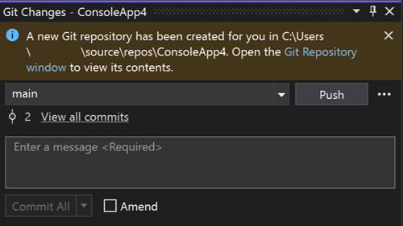

Teď můžete nastavit výchozí název větve pro nová úložiště Git přímo prostřednictvím sady Visual Studio. Toto nové nastavení je hladce integrované s konfigurací Gitu a usnadňuje přizpůsobení pracovního postupu vašim preferencím.

Stačí přejít na [Git > Nastavení](vscmd://Team.Git.Settings) a při příštím vytváření úložiště uvidíte v akci vlastní název větve.

