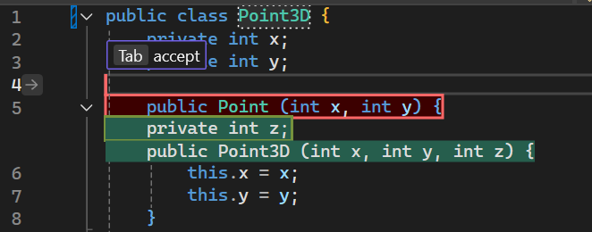

S potěšením oznamujeme, že v sadě Visual Studio jsou nyní k dispozici návrhy dalších úprav (NES), které dále usnadňují psaní kódu. Funkce NES na základě předchozích provedených úprav předpovídá další kroky, jako jsou vložení, odstranění nebo kombinace těchto operací. Na rozdíl od dokončování, která jsou omezená na vytváření návrhů na pozici kurzoru, vám může funkce NES pomoct na libovolném místě v souboru, kde pravděpodobně budou potřebné další úpravy. Funkce NES rozšiřuje stávající dokončování Copilotem o podporu vývojářů při úpravách kódu.

### Začínáme s NES
Funkci NES můžete povolit pomocí možnosti **Nástroje > Možnosti > GitHub > Copilot > Dokončování Copilotem > Povolit další návrhy úprav.**

Stejně jako u dokončování stačí k využívání funkce NES začít psát kód.

Když se zobrazí návrh úprav, který se týká jiného řádku, než na kterém právě jste, můžete nejprve **přejít tabulátorem na odpovídající řádek**. Související úpravy již nemusíte hledat, protože funkce NES vás na ně navede.

 

Až budete na řádku, který vyžaduje úpravu, můžete návrh **přijmout tabulátorem**.

  

Poznámka: Panely nápovědy můžete zapnout nebo vypnout pomocí možnosti **Nástroje > Možnosti > IntelliCode > Rozšířené > Skrýt tip zobrazený šedě**. 

Kromě panelů nápovědy se zobrazuje také šipka v mezeře vedle okraje, která upozorňuje, že je k dispozici návrh úpravy. Po kliknutím na šipku si můžete nabídku návrhu úpravy prohlédnout.

  

### Příklady scénářů
Návrhy dalších úprav můžou být užitečné v různých situacích, a to nejen při provádění zjevných opakovaných změn, ale také u změn souvisejících s logikou. Několik příkladů:

**Refaktoring třídy 2D bodu na 3D bod:**
 

**Aktualizace syntaxe kódu na moderní jazyk C++ pomocí STL:**

Funkce NES umožňuje nejen provádět opakované změny, jako je aktualizace všech zápisů `printf()` na `std::cout`, ale také aktualizovat jiné zápisy, jako například `fgets()`.

**Provádění logických změn v reakci na nově přidanou proměnnou:**

Funkce NES rychle zareaguje na novou proměnnou, která přidává maximální počet odhadů hráče ve hře, a funkce dokončování Copilotem nabídne další pomoc.

### Chcete to vyzkoušet?
Aktivujte nástroj GitHub Copilot Free a odemkněte tuto funkci využívající umělou inteligenci a mnoho dalších.
 Žádná zkušební verze. Žádná platební karta. Jen váš účet GitHub. [Získejte nástroj Copilot Free](https://github.com/settings/copilot).
