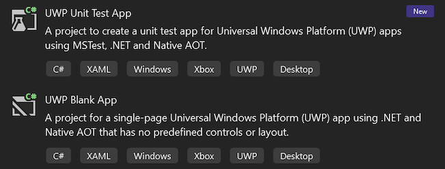

Visual Studio nyní obsahuje novou šablonu projektu UPW MSTest, která je zaměřená na .NET 9 a nativní AOT. V úzké spolupráci s týmem MSTest jsme přidali veškerou potřebnou podporu pro projekty UPW .NET 9 do knihoven a infrastruktury MSTest a do testovacího hostitele sady Visual Studio. To umožňuje, aby projekty testů UPW cílily na .NET 9 a využívaly všechny moderní nástroje .NET SDK a MSTest, zatímco stále běží v kontextu UPW podle očekávání.

Předchozí šablona projektu MSTest pro UPW využívající .NET Native bude nadále k dispozici. Do budoucna ale doporučujeme používat nové šablony projektů, které cílí na .NET 9 a nativní AOT. Stejně jako v sadě Visual Studio 17.13 jsme upravili pořadí všech šablon UPW tak, aby upřednostňovalo nové šablony projektů .NET 9 ve výsledcích hledání.
