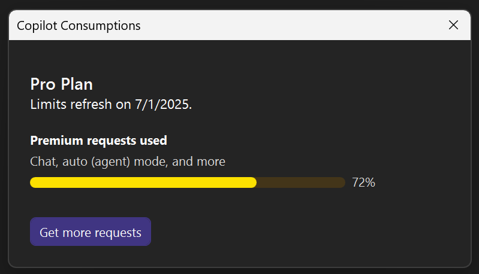

Möchten Sie wissen, wie viel Sie Copilot diesen Monat genutzt haben? Visual Studio enthält jetzt ein **Copilot-Verbrauch**-Panel, mit dem Sie Ihre Nutzung leicht verfolgen können!

Unabhängig davon, ob Sie Copilot Free oder einen kostenpflichtigen Plan verwenden, können Sie die Anzahl Ihrer Chat-Anfragen und Code-Vervollständigungen direkt in der IDE überprüfen.

Klicken Sie dazu auf das **Copilot-Abzeichen** in der oberen rechten Ecke Ihrer IDE und wählen Sie **Copilot-Verbrauch**.

Daraufhin öffnet sich ein Fenster, das Ihren aktuellen Verbrauch für den Monat anzeigt.

> Tipp: Wenn Sie Premium-Modelle verwenden, werden in der Modellauswahl auch die Verbrauchsmultiplikatoren angezeigt, so dass Sie immer genau wissen, was Sie verwenden.

### Möchten Sie es selbst ausprobieren?
Aktivieren Sie GitHub Copilot Free, und nutzen Sie dieses und viele weitere KI-Features.
 Keine Testversion. Keine Kreditkarte. Nur Ihr GitHub-Konto. [Laden Sie Copilot Free herunter](https://github.com/settings/copilot).
