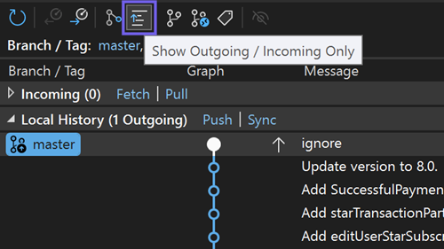

Das [Git Repository-Fenster](vscmd://Team.Git.GoToGitSynchronization) {KeyboardShortcut:Team.Git.GoToGitSynchronization} ist Ihre erste Anlaufstelle, um Ihren Git-Verlauf zu verstehen. Während Sie an einer lokalen Verzweigung arbeiten, wird sie möglicherweise nicht mehr mit Ihrer Remoteverbindung synchronisiert, entweder weil Sie neue Commits (ausgehend) erstellt haben oder es neue Commits zum Abrufen (eingehender) gibt.

Mit dem neuen Filter Ausgehend/Eingehend in der Symbolleiste können Sie diese nicht synchronisierten Übertragungen sofort erkennen. Ihre Commits, deren Commits – scannen Sie sie mit Leichtigkeit und bleiben Sie perfekt synchronisiert!

