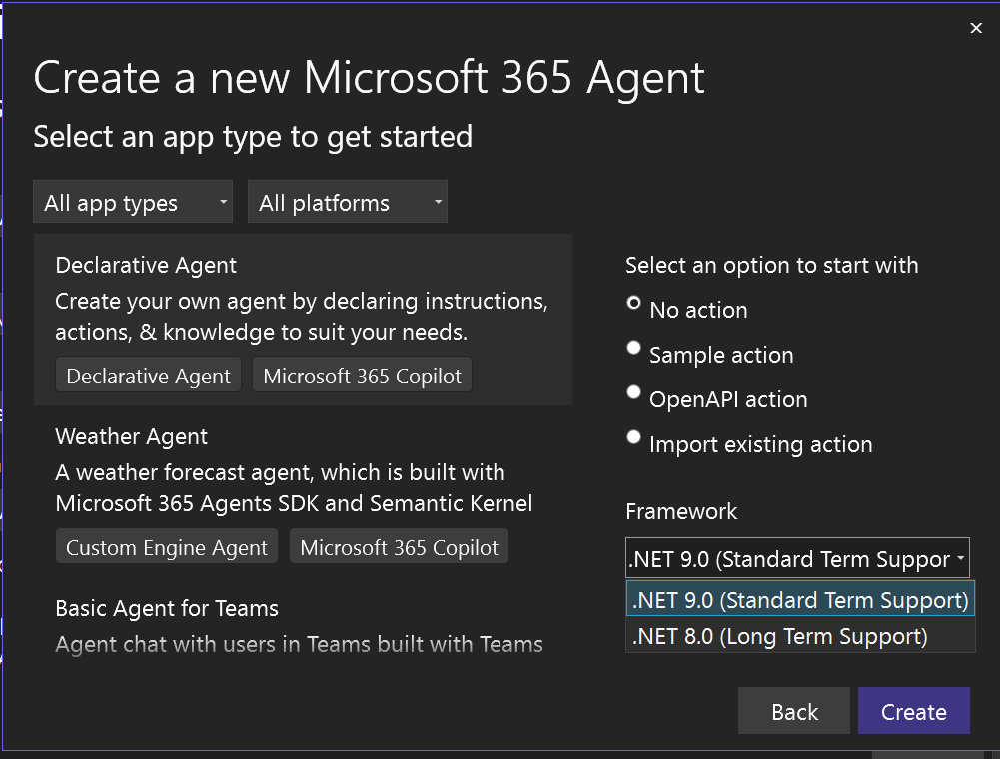

Wir freuen uns, Ihnen mitteilen zu können, dass unser Produkt, das bisher als Teams Toolkit bekannt war, in Microsoft 365 Agents Toolkit umbenannt wird. Diese Änderung spiegelt unseren erweiterten Fokus und unser Engagement wider, eine breitere Palette von Plattformen und Projekttypen innerhalb der Microsoft 365 Infrastruktur zu unterstützen.

Mit der weiteren Verbesserung unseres Produkts verlagern wir unseren Schwerpunkt von der reinen Unterstützung der Teams-Entwicklung auf die Unterstützung von Entwicklern bei der Erstellung von Microsoft 365 Copilot-Agenten und anderen Anwendungen auf der gesamten Microsoft 365-Plattform. Zu diesen Plattformen gehören Microsoft 365 Copilot, Microsoft Teams, die Office-Familie und Outlook. Diese Erweiterung des Bereichs bietet uns die Möglichkeit, unsere Benutzer besser zu unterstützen, indem wir umfassende Tools, Vorlagen und Ressourcen für die Entwicklung einer Vielzahl von Microsoft 365-Lösungen bereitstellen.

Der neue Name, Microsoft 365 Agents Toolkit, repräsentiert die vielfältigen Funktionalitäten und Funktionalitäten unseres Produkts besser. Wir glauben, dass diese Änderung unseren Benutzern helfen wird, das gesamte Spektrum der Entwicklungsmöglichkeiten innerhalb der Microsoft 365 Umgebung leichter zu erkennen.

Wir danken Ihnen für Ihre anhaltende Unterstützung bei der Erfüllung der wachsenden Anforderungen unserer Entwickler Community.

### Erstellen eines deklarativen Agents 

Wir freuen uns, Ihnen mitteilen zu können, dass wir in dieser Version Projektvorlagen für die Erstellung deklarativer Agenten für Microsoft 365 Copilot hinzugefügt haben.

Sie können einen Declarative Agent mit oder ohne eine Aktion erstellen. Sie haben die Wahl, neue APIs zu definieren oder bestehende zu verwenden, um Aufgaben auszuführen oder Daten abzurufen.

Verwenden Sie Microsoft 365 Agents Toolkit, um Ihre deklarativen Agenten in Microsoft Copilot zu debuggen und eine Vorschau zu erstellen.

### Reibungsloses Debuggen mit nur einem Klick aktivieren
In früheren Versionen von Teams Toolkit, das jetzt Microsoft 365 Agents Toolkit heißt, mussten Benutzer beim Debuggen einer generierten Lösung den Befehl **Abhängigkeit der Teams App vorbereiten** verwenden, bevor sie das Projekt debuggen konnten. Dieser Befehl triggerte das Toolkit, um Entwicklern dabei zu helfen, wichtige Ressourcen für die Fehlersuche zu erstellen, wie z. B. die Registrierung oder Aktualisierung der Teams App.

Um die Debugerfahrung zu verbessern und für Visual Studio-Benutzer intuitiver zu machen, haben wir diesen Schritt entfernt und das Debuggen mit einem Klick aktiviert. Jetzt können Sie ohne Vorbereitungsschritte direkt auf die Debugschaltfläche klicken. Wenn Sie jedoch zwischen zwei Ereignissen zum Debuggen Änderungen an Ihrem App-Manifest vorgenommen haben und Ihre App aktualisieren müssen, gibt es weiterhin eine Option, dies zu tun.
Wir bieten zwei Debugprofile an:

- **Debuggen mit Aktualisierung der App**: Wählen Sie das Standardprofil `[Your Target Launch Platform] (browser)`, wenn Sie Änderungen an Ihrer App vorgenommen haben, um sicherzustellen, dass die Updates übernommen werden.
- **Debuggen ohne App-Aktualisierung**: Wählen Sie das zweite Profil `[Your Target Launch Platform] (browser) (skip update app) `, um die Aktualisierung der Ressourcen der App zu überspringen, so dass das Debuggen leichter und schneller vonstatten geht.

### Aktualisieren auf .NET 9

Außerdem haben wir in dieser Version alle Projektvorlagen aktualisiert, um .NET 9 zu unterstützen.

**Viel Spaß beim Programmieren!**  
*Das Microsoft 365 Agenten Toolkit Team*
