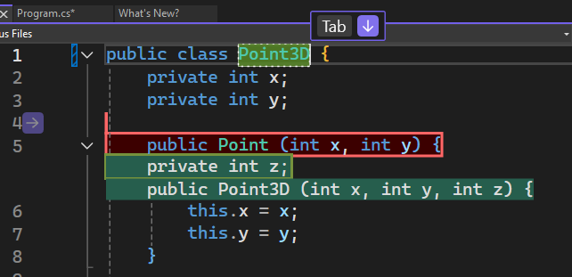
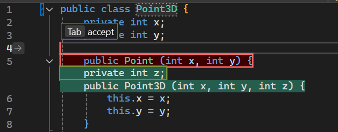

Wir freuen uns, Ihnen mitteilen zu können, dass Nächste Bearbeitungsvorschläge (Next Edit Suggestions, NES), jetzt in Visual Studio verfügbar ist, um Ihre Coding-Erfahrung weiter zu verbessern. NES nutzt die vorhergehenden Bearbeitungen und sagt die nächste Bearbeitung voraus, egal ob es sich um eine Einfügung, Löschung oder eine Mischung aus beidem handelt. Im Gegensatz zu „Vervollständigungen“, das Vorschläge nur an der Position des Cursors generiert, unterstützt NES Sie überall in Ihrer Datei, wo die nächste Bearbeitung am wahrscheinlichsten ist. NES erweitert das bestehende Copilot Completions-Erlebnis, indem es die Entwickler bei der Codebearbeitung unterstützt.

### Erste Schritte mit NES
Aktivieren Sie NES über **Extras > Optionen > GitHub > Copilot > Copilot-Vervollständigungen > Nächste Bearbeitungsvorschläge aktivieren**.

Wie bei den Komplettierungen müssen Sie nur mit dem Programmieren beginnen, um NES zu erhalten!

Wenn Sie einen Bearbeitungsvorschlag erhalten und dieser sich in einer anderen Zeile befindet als die, in der Sie sich gerade befinden, wird Ihnen vorgeschlagen, zuerst mit **Tab zu der entsprechenden Zeile zu navigieren** . Sie müssen nicht mehr manuell nach verwandten Bearbeitungen suchen; NES wird Ihnen den Weg weisen!

 

Wenn Sie sich in der gleichen Zeile wie die Bearbeitung befinden, können Sie den Vorschlag mit der **Tabulator-Taste annehmen**.

  

Hinweis: Sie können die Hinweisleisten ein- und ausblenden, indem Sie auf **„Extras“ > „Optionen“ > „IntelliCode“ > „Erweitert“ > „Tipp mit grauem Text ausblenden“** klicken. 

Zusätzlich zu den Hinweisleisten erscheint auch ein Pfeil in der Zwischenleiste, der anzeigt, dass ein Bearbeitungsvorschlag verfügbar ist. Sie können auf den Pfeil klicken, um das Menü mit den Bearbeitungsvorschlägen zu öffnen.

  

### Beispielszenarien
Nächste Bearbeitungsvorschläge können in einer Vielzahl von Szenarien hilfreich sein, nicht nur für offensichtliche, sich wiederholende Änderungen, sondern auch für logische Änderungen. Im Folgenden finden Sie einige Beispiele:

**Refactoring einer 2D-Punkt-Klasse zu 3D-Punkt:**
 

**Aktualisierung der Codesyntax auf modernes C++ mit STL:**

Beachten Sie, dass NES nicht nur sich wiederholende Änderungen wie die Aktualisierung aller `printf()` zu `std::cout` vornimmt, sondern auch andere Syntax wie `fgets()` aktualisiert.

**Die logischen Änderungen als Reaktion auf eine neu hinzugefügte Variable:**

NES reagiert schnell auf die neue Variable, die eine maximale Anzahl von Vermutungen in einem Spiel zulässt, und auch Copilot Completions springt ein, um zu helfen.

### Möchten Sie es selbst ausprobieren?
Aktivieren Sie GitHub Copilot Free, und nutzen Sie dieses und viele weitere KI-Features.
Keine Testversion. Keine Kreditkarte. Nur Ihr GitHub-Konto. [Laden Sie Copilot Free herunter](https://github.com/settings/copilot).
