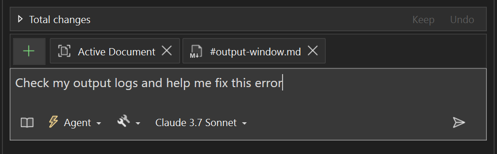

Wir wissen, dass das Ausgabefenster für die Verfolgung von Builds, die Fehlersuche und das Verständnis dessen, was unter der Haube vor sich geht, unerlässlich ist. Jetzt kann Copilot diese Informationen lesen, so dass Sie Fragen stellen, Hilfe erhalten und auf der Grundlage Ihrer Ausgabeprotokolle Maßnahmen ergreifen können.

### Verwendung
- Verwenden Sie `#output`, um direkt im Chat darauf zu verweisen.
- Klicken Sie auf das Symbol ➕ in der Chat-Eingabe, um es als Kontext hinzuzufügen.
- Fragen Sie Copilot direkt: *Prüfe meine Ausgabeprotokolle und hilf mir, diesen Fehler zu beheben.*
- Oder klicken Sie mit der rechten Maustaste in das **Ausgabefenster** und wählen Sie **Mit Copilot erklären**, um es sofort zuzuordnen.

Probieren Sie es aus und sehen Sie, wie viel einfacher es ist, Ihre Protokolle zu lesen und darauf zu reagieren!

### Möchten Sie es selbst ausprobieren?
Aktivieren Sie GitHub Copilot Free, und nutzen Sie dieses und viele weitere KI-Features.
 Keine Testversion. Keine Kreditkarte. Nur Ihr GitHub-Konto. [Laden Sie Copilot Free herunter](https://github.com/settings/copilot).
