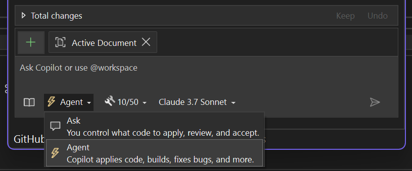

It unlocks a new way to build with GitHub Copilot, going beyond single-turn prompts to handle entire tasks from start to finish.

To get started, open Copilot Chat, click the **Ask** button, and switch to **Agent**.

### From Idea to Code

Agent Mode understands your intent, creates a plan, pulls in the right context, and takes action. It can fix bugs, edit files, and build your solution—all from a single prompt until your goal is reached.

With MCP integration, Agent Mode can also pull in rich context from your connected systems—like GitHub, CI pipelines, or monitoring dashboards—to take even smarter actions.

Try it out and see what improvements it can offer!

### Want to try this out?
Activate GitHub Copilot Free and unlock this AI feature, plus many more.
No trial. No credit card. Just your GitHub account. [Get Copilot Free](https://github.com/settings/copilot).
