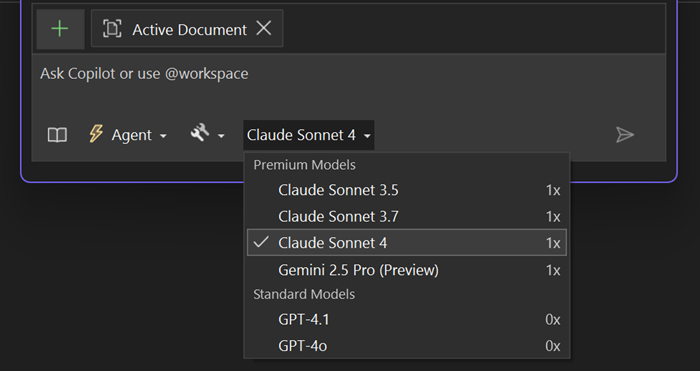

We're excited to announce that Claude Sonnet 4 and Claude Opus 4 are now generally available to all Visual Studio customers!

* Use Claude Sonnet 4 in *Agent Mode* for faster, more focused interactions.
* Try both Claude Sonnet 4 and Opus 4 in *Ask Mode* for deeper reasoning. 

To get started, open Chat in Visual Studio, select the model picker, and choose the Claude model that fits your workflow.

### Want to try this out?
Activate GitHub Copilot Free and unlock this AI feature, plus many more.
No trial. No credit card. Just your GitHub account. [Get Copilot Free](https://github.com/settings/copilot).
