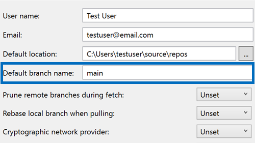

You can now set the default branch name for new Git repositories directly through Visual Studio. This new setting integrates smoothly with your Git configuration, making it easier to tailor your workflow to your preferences.

Simply navigate to [Git > Settings](vscmd://Team.Git.Settings), and the next time you create a repository, you will see your custom branch name in action.

