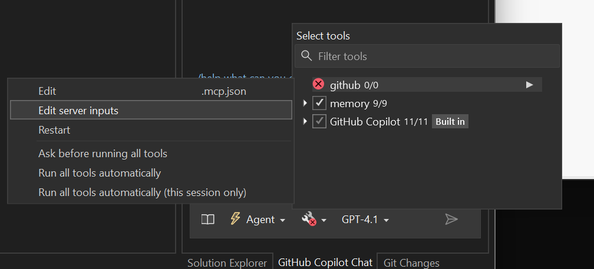
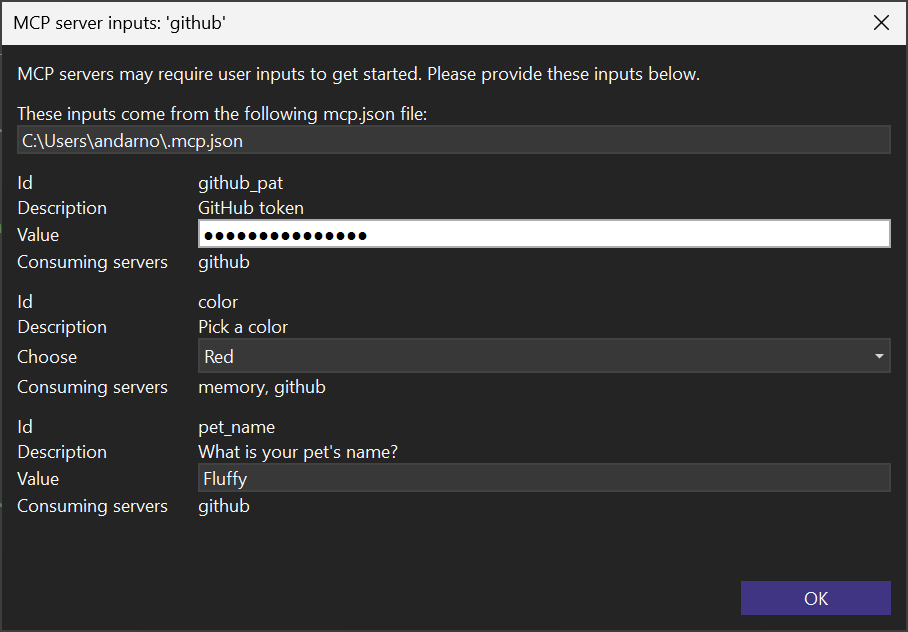

We've made significant improvements to MCP server integration in Visual Studio to help you unlock a more powerful, connected engineering stack.

### Set Up Your MCP Server

Add an `mcp.json` file to your solution — Visual Studio will detect it automatically (we also support `.vscode/mcp.json`). Start and manage servers directly with CodeLens controls at the top of each server block. Easily restart, run, and control inputs from within the editor.

With seamless authentication via keychain support, you can now authenticate with supported MCP servers directly in Visual Studio using your existing keychain credentials — no additional configuration needed.

### Use Your MCP Servers

Open the **Tools** dropdown in the Copilot Chat panel to view connected MCP servers and manage them by selecting the arrow to reveal the new menu. From there, you can manage server inputs in our new modal dialog. Copilot can then pull in context and take action using your existing systems.

**Note:** You will need to be in *Agent Mode* to access and interact with MCP servers.

---

Bring the full power of your stack into Copilot without leaving Visual Studio!

### Want to try this out?
Activate GitHub Copilot Free and unlock this AI feature, plus many more.
No trial. No credit card. Just your GitHub account. [Get Copilot Free](https://github.com/settings/copilot).
