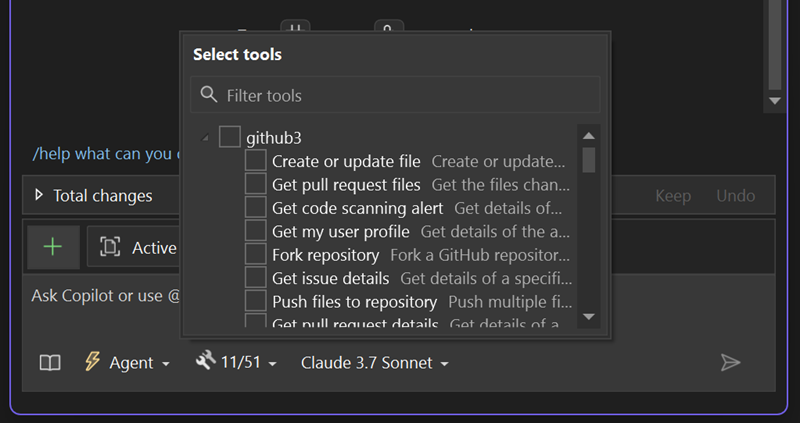

Visual Studio now supports MCP servers, unlocking smarter and more connected AI development. MCP is an open protocol that standardizes how apps and AI agents share context and take action. 

With MCP in Visual Studio, you can do more than just retrieve information from your MCP servers, such as logs, test failures, PRs, or issues. You can also use that information to drive **meaningful actions** in your code, your IDE, and even your connected systems across your stack.

### Set Up Your MCP Server

Add an `mcp.json` file to your solution, and Visual Studio will detect it automatically. It also recognizes configs from other environments like `.vscode/mcp.json`.

### Use Your MCP Servers

Open the **Tools** dropdown in the Copilot Chat panel to view connected MCP servers. From there, Copilot can pull in context and take action using your existing systems.

**Note:** You will need to be in *Agent Mode* to access and interact with MCP servers.

---

Bring the full power of your stack into Copilot without leaving Visual Studio!

### Want to try this out?
Activate GitHub Copilot Free and unlock this AI feature, plus many more.
No trial. No credit card. Just your GitHub account. [Get Copilot Free](https://github.com/settings/copilot).
