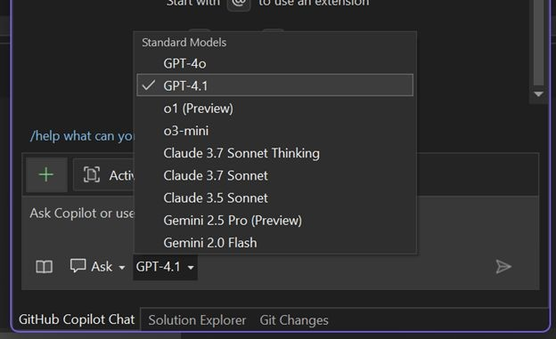

More power, speed, and flexibility — all within your IDE!

### 🚨 Gemini 2.5 Pro is now in Visual Studio

Gemini 2.5 Pro, widely regarded as one of the top-performing models available, is now supported in Visual Studio. It joins GPT-4.1, GPT-4o, Claude Sonnet 3.7, Claude Sonnet 3.5, and o3 mini to bring a truly versatile multi-model AI experience to your IDE.

### 🚨 GPT-4.1 is now the default

GPT-4.1 is now the default model in Visual Studio, offering a faster, more responsive, and noticeably smoother experience across the board.

---

You can now select the best model for the task, code, and workflow at hand. Try them out and let us know what you think!

### Want to try this out?
Activate GitHub Copilot Free and unlock this AI feature, plus many more.
No trial. No credit card. Just your GitHub account. [Get Copilot Free](https://github.com/settings/copilot).
