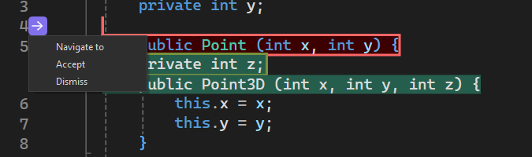

We are excited to announce Next Edit Suggestions, or NES for short, is now available in Visual Studio to further improve your coding experience. NES leverages the previous edits made and predicts the next edit to come, whether it's an insertion, deletion, or mix of both. Unlike Completions which is limited to generate suggestions at your caret location, NES can support you anywhere in your file, where the next edit is most likely to occur. NES augments the existing Copilot Completions experience by supporting developers' code editing activities.

### Getting Started with NES
Enable NES via **Tools > Options > GitHub > Copilot > Copilot Completions > Enable Next Edit Suggestions.**

Like completions, all you need to do to get NES is to start coding!

When you're presented with an edit suggestion, if it is on a different line than the one you are on now, it will suggest you **Tab to Navigate to the corresponding line** first. You won't need to manually search for related edits anymore; NES will lead the way!

 

After you are on the same line as the edit, you can **Tab to Accept** the suggestion.

  

Note: You can turn on/off the hint bars by going to **Tools > Options > IntelliCode > Advanced > Hide the tip shown with gray text**. 

In addition to the hint bars, an arrow in the gutter also pops up to indicate that there is an edit suggestion available. You can click on the arrow to explore the edit suggestion menu.

  

### Example Scenarios
Next edit suggestions can be helpful in a variety of scenarios, not only making obvious repetitive changes but also logical changes. Here are some examples:

**Refactoring a 2D Point class to 3D Point:**
 

**Updating code syntax to modern C++ using STL:**

Note that NES is not just making repetitive changes like updating all `printf()` to `std::cout`, but also updating other syntax such as `fgets()`.

**Making logical changes in response to a newly added variable:**

NES responds quickly to the new variable, which adds a maximum number of guesses a player can make in a game, and Copilot Completions also jumps in to help.

### Want to try this out?
Activate GitHub Copilot Free and unlock this AI feature, plus many more.
No trial. No credit card. Just your GitHub account. [Get Copilot Free](https://github.com/settings/copilot).
