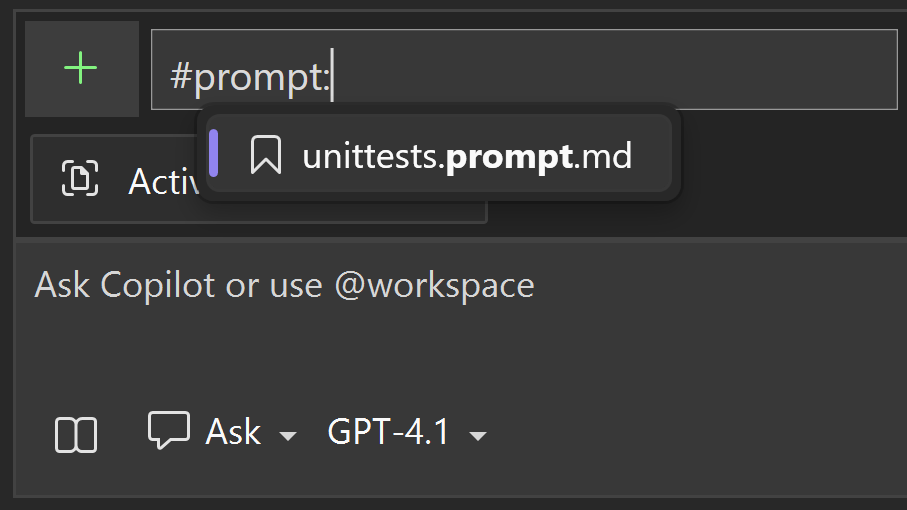

Writing effective prompts can be time consuming, but it's the key to getting the most out of Copilot Ask and Agent mode. We've enabled reusable prompt files to allow you to leverage these great prompts again and again. From there, you can run quickly from the chat window or share with your team.  

### How to Write Prompt Files 

1. Write your prompts the way you normally would in the prompt box, attaching # references to add specific information from your solution like methods, classes, and files. You can even reference other prompt files to include common base instructions. 
1. Then, copy it from the prompt box into a markdown file, and save it with the .prompt.md file extension in the root of your repository in the `.github/prompts` folder.

Tip: You can even get Copilot's help in refining your prompt to be more specific 

### How to Run Your Prompts

1. Start typing `#prompt:` to reference all the prompt files from your `.github/prompts` folder directly in chat or click the ➕ icon in the chat input to add it as context. 
1. Add any additional information in the prompt box or just send the prompt! 

Give it a try and speed up your AI workflows!

### Want to try this out?
Activate GitHub Copilot Free and unlock this AI feature, plus many more.
No trial. No credit card. Just your GitHub account. [Get Copilot Free](https://github.com/settings/copilot).
