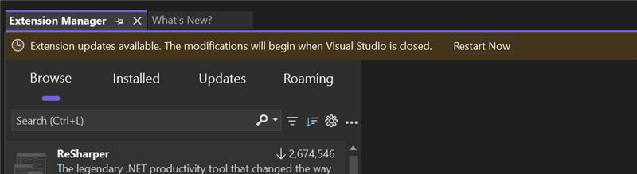

Nos complace presentar un conjunto de nuevas características eficaces en Visual Studio que simplifican el flujo de trabajo y mejoran la experiencia de uso al administrar extensiones. Estas actualizaciones le permiten estar al tanto de todo sin esfuerzo, al tiempo que le dan más control sobre cómo y cuándo se aplican las actualizaciones.

### Novedades

**Actualizaciones automáticas y sencillas**

Visual Studio habilitará automáticamente las actualizaciones al abrir la aplicación, asegurándose de que tenga siempre las características y correcciones de errores más recientes sin que haga nada de forma manual.

**Reinicio de la barra dorada para las actualizaciones aplicadas**

Cuando se aplican las actualizaciones, le saldrá una notificación en la barra dorada, que le pedirá que reinicie Visual Studio para que los cambios surtan efecto.

**Configuración de actualizaciones automáticas en la página de extensiones**

Hemos hecho que la configuración de las actualizaciones automáticas sea más accesible integrándola directamente en la página de extensiones, lo que le permite acceder al momento a las opciones de configuración.

**Filtrar por cambios pendientes**

La nueva categoría **Pendiente** ahora resalta los cambios pendientes, para que pueda estar informado de las actualizaciones y las modificaciones que necesitan su atención.

**Configuración de actualizaciones automáticas**

Además de la página de extensiones, la opción de configuración de actualizaciones automáticas ya está disponible en **Herramientas > Opciones > Entorno > Extensiones**, lo que permite una experiencia de uso más intuitiva a la hora de gestionar la configuración.

**Uso simplificado de la configuración**

Hemos hecho más sencilla la interfaz de usuario de configuración, para que sea más fácil configurar las actualizaciones automáticas y otras preferencias relacionadas con menos clics y opciones más claras.

**Lista de extensiones excluidas**

Visual Studio ahora incluye una lista Extensiones excluidas que se rellena automáticamente, lo que le permite administrar las extensiones que no quiera que se actualicen automáticamente. Esto es especialmente útil con las extensiones más importante en las que prefiere controlar de forma manual las actualizaciones de versiones.

Estas mejoras están diseñadas para mejorar la facilidad de uso, reducir la complejidad de las actualizaciones y darle un mayor control sobre el entorno de desarrollo, a la vez que garantiza que se beneficie de las últimas mejoras.
