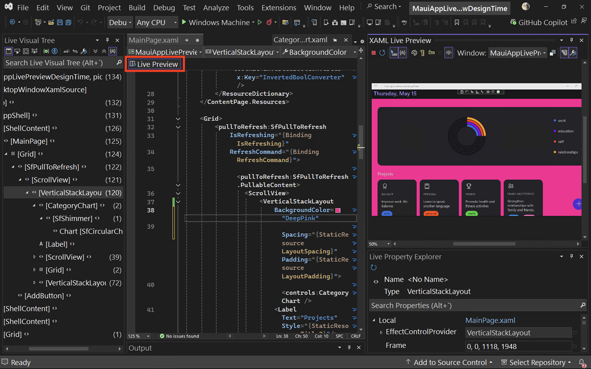

La vista previa dinámica ya está disponible durante el periodo de diseño, lo que permite la visualización en tiempo real de los cambios en la IU de la aplicación. Ahora Hot Reload y otras herramientas dinámicas de la IU también se pueden usar de esta manera, lo que garantiza un flujo de trabajo regular .

Estas herramientas se pueden utilizar incluso separadas del depurador, lo que permite experimentar y perfeccionar los diseños sin interrupciones.

Haga clic en el nuevo indicador de **Vista previa dinámica** para acceder a la vista previa dinámica en tiempo de diseño desde cualquier archivo XAML:

Tanto si está trabajando en una nueva aplicación .NET MAUI como en el ajuste de una aplicación WPF existente, estas mejoras le ayudarán a ofrecer aplicaciones de alta calidad más rápidas y con mayor confianza.
