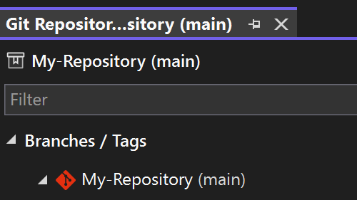
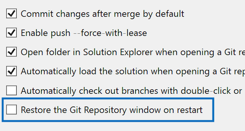

Como entorno dedicado para las operaciones de rama, es probable que la [ventana Repositorio Git](vscmd://Team.Git.GoToGitSynchronization) {KeyboardShortcut:Team.Git.GoToGitSynchronization} esté en el núcleo del desarrollo diario. Si se vuelve a abrir con frecuencia con cada sesión de Visual Studio, esta actualización está diseñada para ahorrar tiempo y esfuerzo.

Hemos agregado una nueva opción a [Git > Configuración](vscmd://Team.Git.Settings) para restaurar automáticamente la ventana Repositorio Git al reiniciar Visual Studio. Además, la ventana se incluirá en los diseños de ventana guardados, lo que mejorará las opciones de personalización.

De forma predeterminada, esta característica está desactivada para que todo siga funcionando sin problemas para aquellos que no lo necesitan. Pero si le gusta la comodidad, este ajuste es perfecto para usted.

