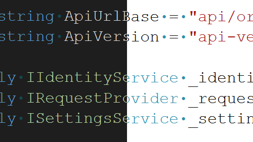

Nous comprenons que les polices que les développeurs choisissent lorsqu’ils codent sont un choix personnel, influencé par des préférences en matière de lisibilité, d’accessibilité ou d’esthétique. Les thèmes de Visual Studio se concentrent principalement sur les couleurs de présentation et sont indépendants des polices préférées.

Avec cette mise à jour, nous avons introduit une fonctionnalité qui conserve vos choix de police et de taille lorsque vous changez de thème. Vous pouvez maintenant définir vos préférences de police une fois et changer de thème dans Visual Studio sans avoir à reconfigurer vos paramètres de police à chaque fois. Notez que les couleurs de vos polices restent liées au thème, car c’est l’objectif des thèmes, mais vos sélections de police seront préservées.

