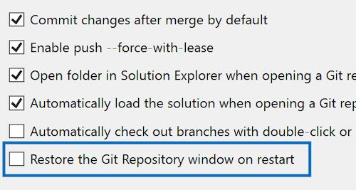

En tant qu’environnement dédié pour les opérations de branche, la [fenêtre Dépôt Git](vscmd://Team.Git.GoToGitSynchronization) {KeyboardShortcut:Team.Git.GoToGitSynchronization} est probablement au cœur de votre développement quotidien. Si vous vous retrouvez à la rouvrir fréquemment à chaque session Visual Studio, cette mise à jour est conçue pour vous faire gagner du temps et des efforts.

Nous avons ajouté un nouveau paramètre à[ Git > Settings](vscmd://Team.Git.Settings) qui restaure automatiquement la fenêtre du référentiel Git lors du redémarrage de Visual Studio. En outre, la fenêtre sera incluse dans vos dispositions de fenêtre enregistrées, améliorant ainsi vos options de personnalisation.

Par défaut, cette fonctionnalité est désactivée pour maintenir un bon fonctionnement pour ceux qui n’en ont pas besoin. Mais si vous aimez ce qui est pratique, ce paramètre est parfait pour vous.

