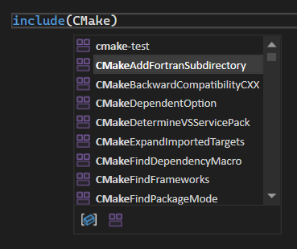

Siamo lieti di annunciare l'aggiunta del supporto per le informazioni rapide e i completamenti basati su IntelliSense per i moduli CMake in Visual Studio. È ora possibile visualizzare tutti i moduli CMake disponibili e ottenere altre informazioni direttamente dall'editor di Visual Studio, rendendo il processo di sviluppo più fluido ed efficiente.

### Informazioni rapide

Passando il puntatore del mouse su un modulo CMake di riferimento, IntelliSense fornisce informazioni dettagliate sul modulo selezionato, consentendo di comprenderne all'istante l'utilizzo e le funzionalità.

### Completamento

Quando si inizia a digitare un modulo CMake in `CMakeLists.txt` o in altri file di script CMake, IntelliSense fornirà un elenco dei moduli disponibili tra cui scegliere.

