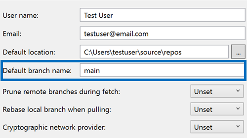

È ora possibile impostare il nome predefinito del ramo per i nuovi repository Git direttamente tramite Visual Studio. Questa nuova impostazione si integra senza problemi alla configurazione Git, semplificando la personalizzazione del flusso di lavoro in base alle preferenze.

Andare a [Git > Impostazioni](vscmd://Team.Git.Settings). Alla successiva creazione di un repository il nome del ramo sarà quello personalizzato.

