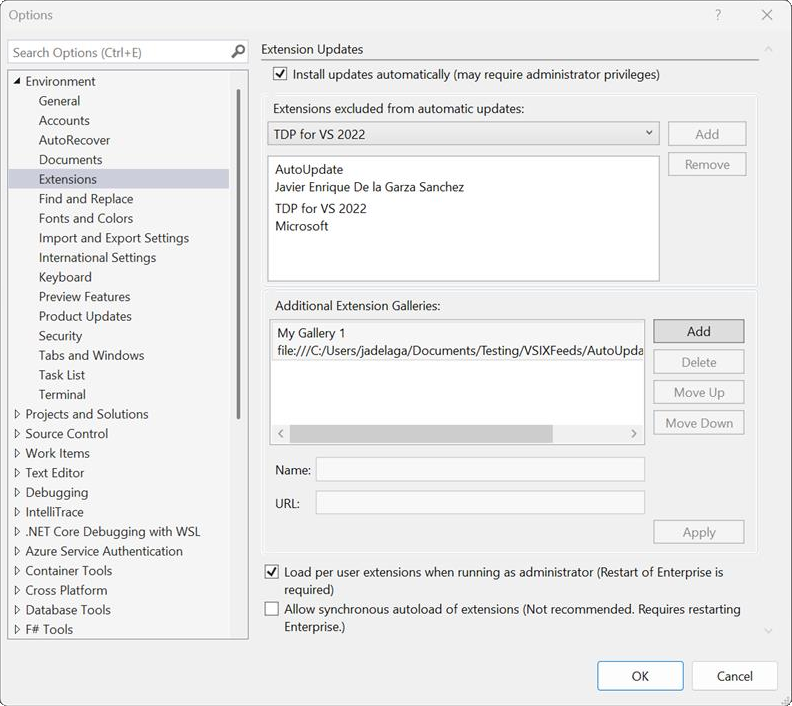

Siamo lieti di introdurre una serie di nuove funzionalità avanzate in Visual Studio per semplificare il flusso di lavoro e migliorare l'esperienza di gestione delle estensioni. Questi aggiornamenti consentono di rimanere aggiornati senza problemi, offrendo maggiore controllo su come e quando vengono applicati gli aggiornamenti.

### Novità

**Aggiornamenti automatici regolari**

Visual Studio attiverà automaticamente gli aggiornamenti all'apertura dell'applicazione, affinché si disponga sempre delle funzionalità e delle correzioni più recenti senza intervento manuale.

**Riavviare la barra gialla per gli aggiornamenti applicati**

Quando vengono applicati gli aggiornamenti, viene visualizzata una notifica sulla barra gialla che chiede di riavviare Visual Studio per rendere effettive le modifiche.

**Impostazioni dell'aggiornamento automatico nella pagina delle estensioni**

Le impostazioni dell'aggiornamento automatico sono state rese più accessibili integrandole direttamente nella pagina delle estensioni, consentendo di accedere rapidamente alle opzioni di configurazione.

**Filtrare in base alle modifiche in sospeso**

Una nuova categoria **In sospeso** evidenzia le modifiche in sospeso, informando sugli aggiornamenti e le modifiche che richiedono attenzione.

**Impostazioni dell'aggiornamento automatico**

Oltre alla pagina delle estensioni, le impostazioni dell'aggiornamento automatico sono ora disponibili in **Strumenti > Opzioni > Ambiente > Estensioni**, offrendo un'esperienza di gestione delle impostazioni più intuitiva.

**Impostazioni semplificate**

L'interfaccia utente delle impostazioni è stata semplificata, semplificando la configurazione degli aggiornamenti automatici e di altre preferenze correlate con un minor numero di clic e opzioni più chiare.

**Elenco delle estensioni escluse**

Visual Studio ora include un elenco delle estensioni escluse che si popola automaticamente, agevolando la gestione delle estensioni che è preferibile non aggiornare automaticamente. Questo è particolarmente utile per le estensioni più critiche in cui si preferisce controllare manualmente gli aggiornamenti delle versioni.

Questi miglioramenti sono progettati per migliorare l'usabilità, ridurre l'attrito tra aggiornamenti e offrire un maggiore controllo sull'ambiente di sviluppo, garantendo al tempo stesso i vantaggi offerti dai miglioramenti più recenti.
