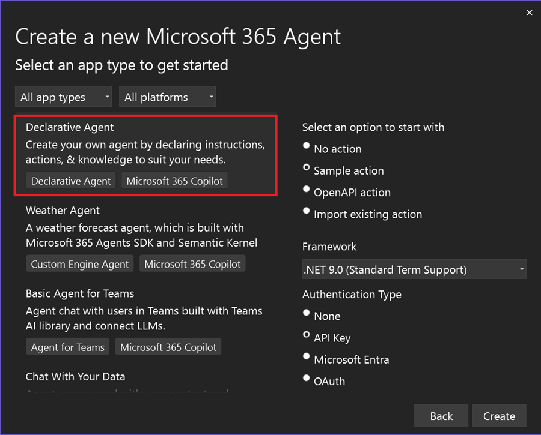
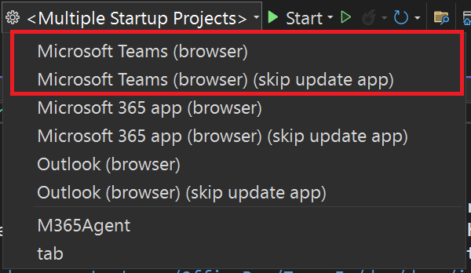
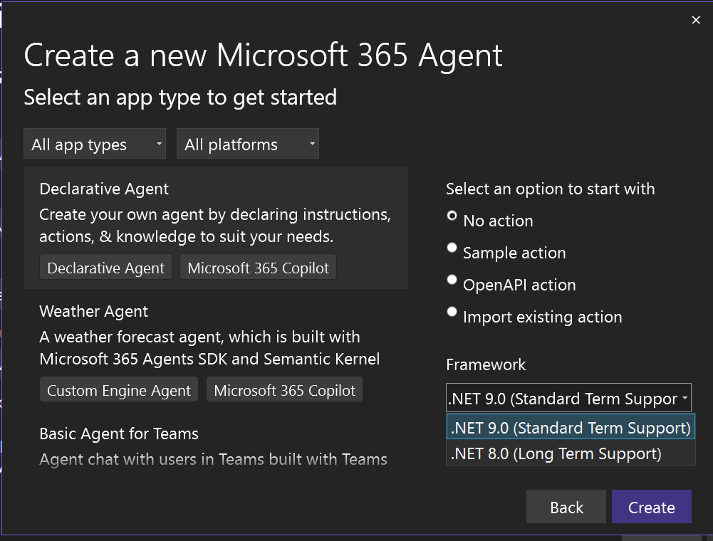

Siamo lieti di annunciare che il prodotto, noto in precedenza come Teams Toolkit, è stato rinominato in Microsoft 365 Agents Toolkit. Questa modifica riflette l'attenzione e l'impegno a supportare una gamma più ampia di piattaforme e tipi di progetto all'interno dell'ecosistema Microsoft 365.

Man mano che continuiamo a migliorare il prodotto, stiamo spostando l'attenzione sul supporto esclusivo dello sviluppo di Teams per consentire agli sviluppatori di creare agenti Copilot di Microsoft 365 e altre applicazioni nella piattaforma Microsoft 365. Queste piattaforme includono Microsoft 365 Copilot, Microsoft Teams, famiglia di Office e Outlook. Questa espansione nell'ambito consente di servire meglio gli utenti fornendo strumenti, modelli e risorse completi per lo sviluppo di un'ampia gamma di soluzioni Microsoft 365.

Il nuovo nome, Microsoft 365 Agents Toolkit, rappresenta meglio le diverse funzionalità e capacità del prodotto. Riteniamo che questa modifica consentirà agli utenti di identificare più facilmente la gamma completa di opportunità di sviluppo disponibili nell'ambiente Microsoft 365.

Grazie per il supporto continuo in fase di evoluzione per soddisfare le esigenze crescenti della community degli sviluppatori.

### Creare un agente dichiarativo 

Siamo entusiasti di annunciare che in questa versione abbiamo aggiunto modelli di progetto per compilare agenti dichiarativi per Microsoft 365 Copilot.

È possibile creare un agente dichiarativo con o senza un'azione. È possibile scegliere di definire nuove API o di usare quelle esistenti per eseguire attività o recuperare dati.

Usare Microsoft 365 Agents Toolkit per eseguire il debug e l'anteprima di agenti dichiarativi in Microsoft Copilot.

### Abilitare il debug con un clic senza problemi
Nelle versioni precedenti di Teams Toolkit, che ora si chiama Microsoft 365 Agents Toolkit, quando gli utenti eseguivano il debug di qualsiasi soluzione generata, era necessario usare il comando **Prepara dipendenza app Teams** prima di eseguire il debug del progetto. Questo comando attivava il toolkit per consentire agli sviluppatori di creare risorse essenziali per il debug, ad esempio la registrazione o l'aggiornamento dell'app Teams.

Per migliorare l'esperienza di debug e renderla più intuitiva per gli utenti di Visual Studio, si è rimosso questo passaggio e si è reso possibile il debug con un clic. È ora possibile fare clic direttamente sul pulsante di debug senza alcuna procedura di preparazione. Tuttavia, se sono state apportate modifiche al manifesto dell'app tra due eventi di debug ed è necessario aggiornare l'app, rimane un'opzione per assolvere a questo scopo.
Sono disponibili due profili di debug:

- **Debug con l'app aggiornata**: selezionare il profilo predefinito `[Your Target Launch Platform] (browser)` se sono state apportate modifiche all'app per assicurarsi che gli aggiornamenti vengano applicati.
- **Debug senza app aggiornata**: scegliere il secondo profilo `[Your Target Launch Platform] (browser) (skip update app) ` per ignorare l'aggiornamento delle risorse dell'app, rendendo il debug più leggero e rapido.

### Eseguire l'aggiornamento a .NET 9

Inoltre, in questa versione abbiamo aggiornato tutti i modelli di progetto per supportare .NET 9.

**Buon lavoro.**  
*Team di Microsoft 365 Agents Toolkit*
