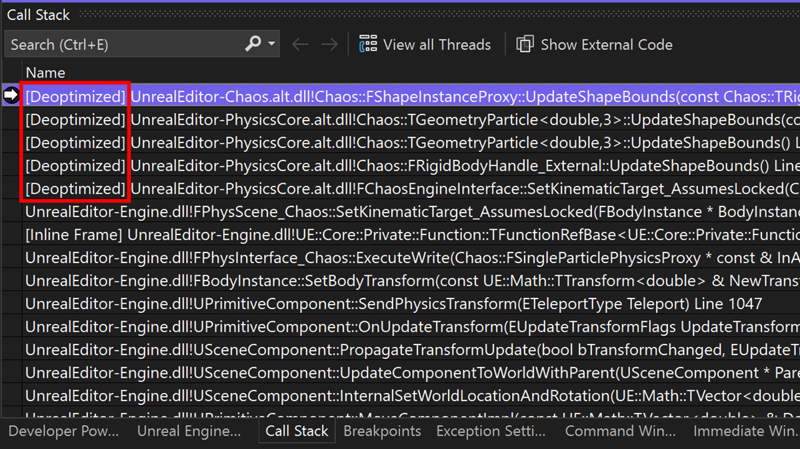

最適化されたコードのデバッグがこれまで以上に簡単になりました。 C++ 動的デバッグをアクティブ化することで、最適化されたコードを、最適化されていない場合と同様にデバッグできます。 すべてのローカル変数を表示し、任意の場所にステップインして、最適化されたバイナリに完全に忠実なブレークポイントを設定できます。 詳細については、こちらの[ブログ記事](https://aka.ms/dynamicdebugging)を参照してください。

