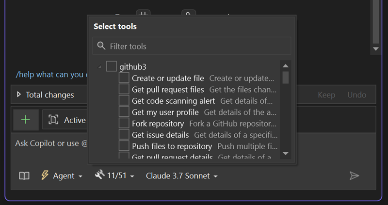

Visual Studio で MCP サーバーがサポートされ、よりスマートでより良く接続された AI デプロイのロックが解除されるようになりました。 MCP は、アプリと AI エージェントがコンテキストを共有してアクションを実行する方法を標準化するオープン プロトコルです。 

Visual Studio の MCP を使用すると、ログ、テスト エラー、PR、問題など、MCP サーバーから情報を取得する以外にもさまざまなことを実行できます。 また、この情報を使用すると、スタック間のコード、IDE、接続されたシステム内で**意味のあるアクション**を促進できます。

### MCP サーバーをセットアップする

`mcp.json` ファイルをソリューションに追加すると、Visual Studio は、自動検出されます。 また、`.vscode/mcp.json` などのその他の環境からの構成も認識されます。

### MCP サーバーを使用する

[Copilot Chat] パネルで **[ツール]** ドロップダウンを開くと、接続された MCP サーバーを表示できます。 そこから、Copilot はコンテキストを取得し、既存システムを使用してアクションを実行できます。

**注:** MCP サーバーにアクセスして操作するには *[エージェント モード]* である必要があります。

---

Visual Studio を離れることなく、スタックのフル パワーを Copilot に取り込んでください。

### さっそくこれを試してみましょう。
GitHub Copilot Free をアクティブ化し、この AI 機能のロックを解除します。
試用版なし。 クレジット カード不可。 GitHub アカウントだけでいいのです。 [Copilotを無料でゲットしよう](https://github.com/settings/copilot)。
