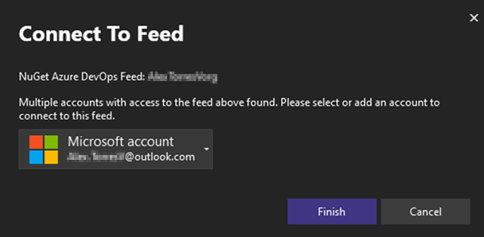

NuGet 認証プロセスが改善されました。 潜在的な認証の問題が検出された場合に、フィードと特定のアカウントのニーズに関するコンテキストを提供する新しい認証ダイアログが表示されるようになります。

この更新プログラムは、多要素認証 (MFA) シナリオの再認証プロセスを強化し、連続する認証プロンプトの問題を解決し、プライベート NuGet フィードを管理するときの全体的なエクスペリエンスを円滑にします。
