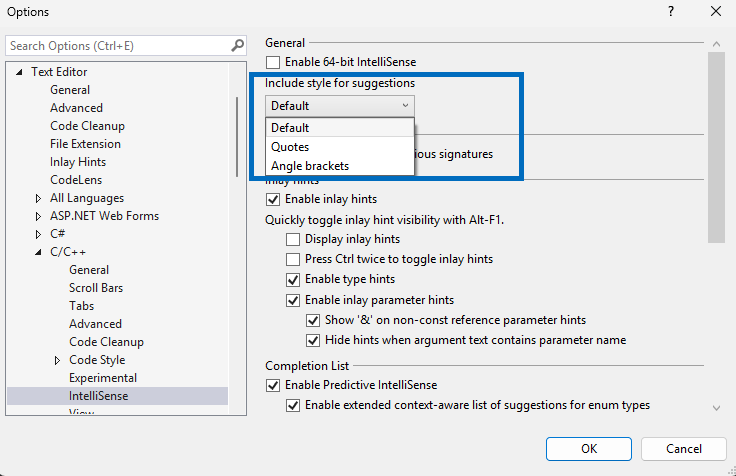

이제 `#include`을 입력할 때 포함 완성 목록에 어떤 헤더가 표시될지 제어할 수 있습니다.

**도구 > 옵션 > 텍스트 편집기 > C/C++ > IntelliSense > 제안 스타일 포함**에서 드롭다운 설정은 이제 포함 제안과 포함 완성 모두에 영향을 미치며, 다음과 같은 세분화된 동작을 제공합니다.

- **핵심 지침(기본값)**: 상대 경로에는 Quote를 사용하고, 나머지에는 꺾쇠 괄호를 사용합니다.
- **인용 부호**: 표준 헤더를 제외한 모든 헤더에 따옴표를 사용하고, 표준 헤더에는 꺾쇠 괄호를 사용합니다.
- **꺾쇠 괄호**: 포함 경로에 속하는 모든 헤더에 꺾쇠 괄호를 사용합니다.

이전에 모든 헤더(상대 경로를 제외하고)는 사용된 구문에 관계없이 제안에 표시되었습니다. 이번 업데이트로 `#include <> and #include ""`을 사용할 때 헤더 제안이 어떻게 표시될지 세분화할 수 있습니다.
