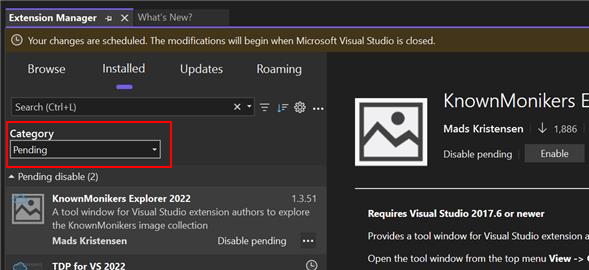

워크플로를 간소화하고 확장 관리 경험을 개선하는 강력한 새로운 기능 세트를 Visual Studio에 도입하게 되어 기쁩니다. 이 업데이트는 업데이트가 적용되는 방식과 시기를 더 많이 제어할 수 있게 하여, 사용자가 손쉽게 최신 상태를 유지할 수 있도록 보장합니다.

### 새로운 기능

**원활한 자동 업데이트**

Visual Studio는 이제 애플리케이션을 열 때 자동으로 업데이트를 트리거하여, 수동 개입 없이 항상 최신 기능과 수정 사항을 사용할 수 있도록 보장합니다.

**적용된 업데이트에 대한 골드 바 다시 시작**

업데이트가 적용되면 금색 바 알림이 나타나며, 변경 사항이 적용되도록 Visual Studio를 다시 시작하라는 메시지가 표시됩니다.

**확장 페이지의 자동 업데이트 설정**

자동 업데이트 설정을 확장 페이지에 직접 통합하여 더 쉽게 접근할 수 있도록 했으며, 이를 통해 구성 옵션에 빠르게 접근할 수 있습니다.

**보류 중인 변경 사항으로 필터링**

새로운 **보류 중** 카테고리는 보류 중인 변경 사항을 강조 표시하여, 업데이트 및 수정 사항에 대한 정보를 제공하고 주의를 기울여야 할 사항을 알려줍니다.

**자동 업데이트 설정**

확장 페이지 외에도 이제 **도구 > 옵션 > 환경 > 확장**에서 자동 업데이트 설정을 사용할 수 있어, 보다 직관적인 설정 관리 환경을 제공합니다.

**간소화된 설정 환경**

설정 UI를 간소화하여 자동 업데이트 및 기타 관련 설정을 더 적은 클릭과 더 명확한 옵션으로 쉽게 구성할 수 있도록 했습니다.

**제외된 확장 목록**

Visual Studio는 이제 자동으로 채워지는 제외된 확장 목록을 제공하여, 자동으로 업데이트되지 않아야 할 확장 프로그램을 관리할 수 있도록 돕습니다. 이는 버전 업데이트를 수동으로 제어하려는 중요한 확장 프로그램에 특히 유용합니다.

이러한 개선 사항은 사용성을 향상시키고, 업데이트의 불편함을 줄이며, 최신 개선 사항을 활용할 수 있도록 하면서 개발 환경에 대한 더 큰 제어권을 제공합니다.
