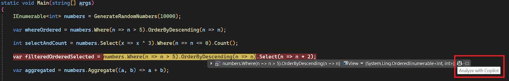

LINQ 쿼리를 생성하고 디버깅하는 과정은 번거롭고 복잡할 수 있으며, 정확한 구문 지식과 여러 번의 반복 작업이 필요할 때가 많습니다. 이러한 문제를 해결하기 위해, Visual Studio 2022는 디버거에서 LINQ 호버 데이터 팁 기능을 제공합니다.

디버깅 중 중단 상태에서는 LINQ 쿼리의 개별 절 또는 구문에 마우스를 올려 현재 실행 중인 쿼리 값을 즉시 평가할 수 있습니다.

또한, DataTip 끝에 있는 GitHub Copilot 아이콘을 클릭하면 마우스를 올린 특정 쿼리 절에 대해 *Copilot으로 분석*을 수행할 수 있습니다. 그러면 Copilot이 해당 절의 구문을 설명하고, 지정된 결과가 나타나는 이유를 명확히 알려줍니다.

이 기능은 효율성을 크게 향상시키고 디버깅을 더욱 원활하고 쉽게 만들어, LINQ 쿼리의 문제를 더 빠르게 찾아내고 전체 개발 워크플로우를 간소화하는 데 도움이 됩니다.

### 이 작업을 시도해 보시겠습니까?
GitHub Copilot Free를 활성화하고 이 AI 기능의 잠금을 해제합니다.
평가판 없음 신용카드 없음. 귀하의 GitHub 계정만. [Copilot 무료로 사용하기](https://github.com/settings/copilot).
