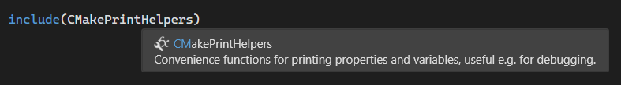
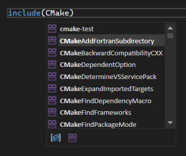

Z przyjemnością informujemy, że zostało dodana obsługa uzupełniania opartego na technologii IntelliSense i szybkich informacji do modułów CMake w programie Visual Studio. Teraz możesz wyświetlić wszystkie dostępne moduły CMake i dowiedzieć się więcej o nich bezpośrednio z poziomu edytora programu Visual Studio, aby proces programowania był sprawniejszy i wydajniejszy.

### Szybkie informacje

Po najechaniu kursorem na moduł CMake w odwołaniu funkcja IntelliSense wyświetla szczegółowe informacje na temat wybranego modułu, ułatwiając błyskawiczne zrozumienie jego użycia i funkcjonalności.

### Zakończenie

Po rozpoczęciu wpisywania modułu CMake w listach `CMakeLists.txt` lub innych narzędziach skryptu CMake funkcja IntelliSense wyświetla listę dostępnych modułów do wyboru.

