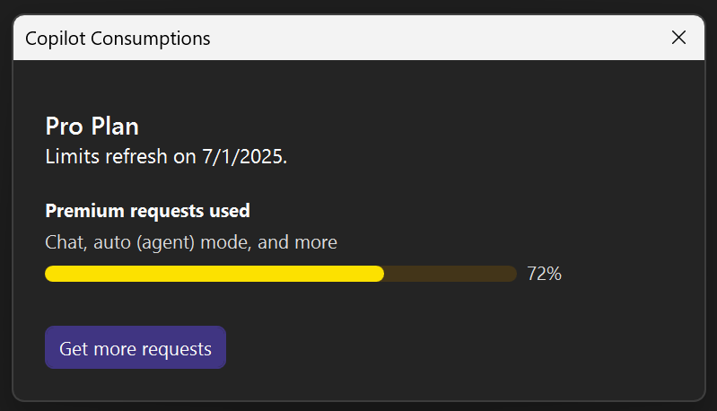

Chcesz wiedzieć, jak często używany był Copilot w tym miesiącu? Program Visual Studio zawiera teraz panel **Zużyciaw Copilot** w celu łatwego śledzenia użycia.

Niezależnie od tego, czy korzystasz z bezpłatnej wersji funkcji Copilot, czy planu płatnego, możesz sprawdzić liczbę żądań czatów i uzupełniania kodu bezpośrednio ze środowiska IDE.

Uzyskaj dostęp do niego, klikając **Copilot** w prawym górnym rogu środowiska IDE i wybierając pozycję **Zużyciaw Copilot**.

Spowoduje to otwarcie panelu z bieżącym użyciem dla danego miesiąca.

> Porada: jeśli używasz modeli Premium, zobaczysz również mnożniki użycia wymienione w selektorze modelu, więc zawsze wiesz dokładnie, czego używasz.

### Chcesz ją wypróbować?
Aktywuj darmową aplikację GitHub Copilot i odblokuj tę funkcję sztucznej inteligencji oraz wiele innych.
Brak wersji próbnej. Brak karty kredytowej. Wystarczy twoje konto usługi GitHub. [Uzyskaj bezpłatnie Copilot](https://github.com/settings/copilot).
