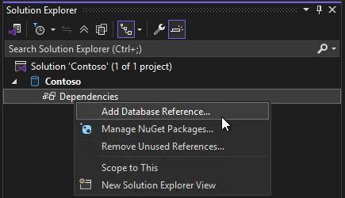

Aktualizacja w programie Visual Studio 17.14 wprowadza nowe szablony elementów i odwołania bazy danych dacpac do narzędzi SQL Server Data Tools w stylu zestawu SDK (wersja zapoznawcza). Projekty SSDT SQL w stylu SDK są oparte na zestawie Microsoft.Build.Sql SDK, który zapewnia obsługę wielu platform i ulepszone funkcje CI/CD w projektach SQL Server Data Tools (SSDT).

Dzięki mniej pełnym plikom projektu i odwołaniom bazy danych do pakietów NuGet zespoły mogą wydajniej współpracować nad dużymi bazami danych w jednym projekcie lub kompilować wiele zestawów obiektów z kilku projektów. Wdrożenia baz danych z projektu Microsoft.Build.Sql można zautomatyzować w środowiskach systemu Windows i Linux publikując artefakt kompilacji (.dacpac) z projektu SQL przy użyciu narzędzia Microsoft.SqlPackage dotnet. Dowiedz się więcej o [projektach SQL w stylu SDK i DevOps dla SQL](https://aka.ms/sqlprojects).

W wersji 17.14 [odwołania bazy danych](https://learn.microsoft.com/sql/tools/sql-database-projects/concepts/database-references?pivots=sq1-visual-studio-sdk) są rozszerzane w celu obsługi odwołań artefaktów project i dacpac. Obsługa odwołań do bazy danych jako odwołań do pakietów zostanie udostępniona w przyszłej wersji. Najnowsza wersja [generatora plików rozwiązania slngen](https://github.com/microsoft/slngen) dodała również obsługę projektów Microsoft.Build.Sql, umożliwiając programowe zarządzanie dużymi rozwiązaniami.

Aby używać projektów SSDT w stylu zestawu SQL w rozwiązaniu, należy zainstalować najnowszy składnik SSDT w wersji zapoznawczej w instalatorze programu Visual Studio.

