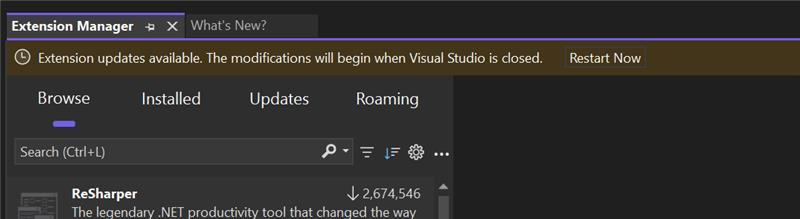
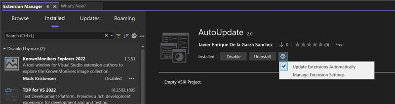
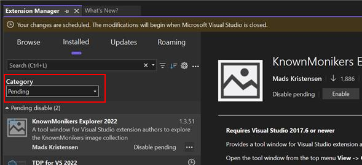
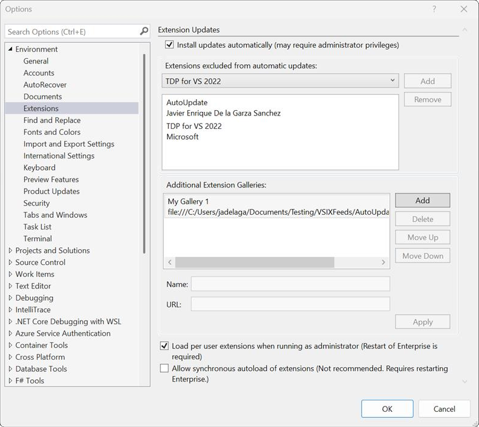

Estamos empolgados de apresentar um conjunto de novos recursos poderosos no Visual Studio que simplificam seu fluxo de trabalho e melhoram a experiência de gerenciamento de extensões. Essas atualizações garantem que você se mantenha atualizado sem esforço e, ao mesmo tempo, oferecem mais controle sobre como e quando as atualizações são aplicadas.

### Novidades

**Atualizações automáticas contínuas**

O Visual Studio agora disparará atualizações automaticamente quando você abrir a aplicação, garantindo que você sempre tenha os recursos e correções mais recentes sem intervenção manual.

**Reiniciar a barra de ouro para atualizações aplicadas**

Quando as atualizações forem aplicadas, uma notificação de barra de ouro será exibida, solicitando que você reinicie o Visual Studio para que as alterações entrem em vigor.

**Configurações de atualização automática na página de extensão**

Tornamos as configurações de atualização automática mais acessíveis, integrando-as diretamente na página de extensão, dando a você acesso rápido às opções de configuração.

**Filtrar por alterações pendentes**

A nova categoria **Pendente** agora destaca as alterações pendentes, mantendo você informado sobre as atualizações e modificações que exigem atenção.

**Configurações de atualização automática**

Além da página de extensão, as configurações de atualização automática agora estão disponíveis em **Ferramentas > Opções > Ambiente > Extensões**, permitindo uma experiência de gerenciamento de configurações mais intuitiva.

**Experiência de configurações simplificadas**

Simplificamos a interface do usuário de configurações, facilitando a configuração de atualizações automáticas e outras preferências relacionadas com menos cliques e opções mais claras.

**Lista de extensões excluídas**

Agora o Visual Studio apresenta uma lista de extensões Excluído que é preenchida automaticamente, ajudando você a gerenciar extensões que não devem ser atualizadas automaticamente. Isso é especialmente útil para extensões de missão crítica em que você prefere controlar as atualizações de versão manualmente.

Esses aprimoramentos foram projetados para melhorar a usabilidade, reduzir o atrito de atualização e oferecer maior controle sobre seu ambiente de desenvolvimento, garantindo que você se beneficie das melhorias mais recentes.
