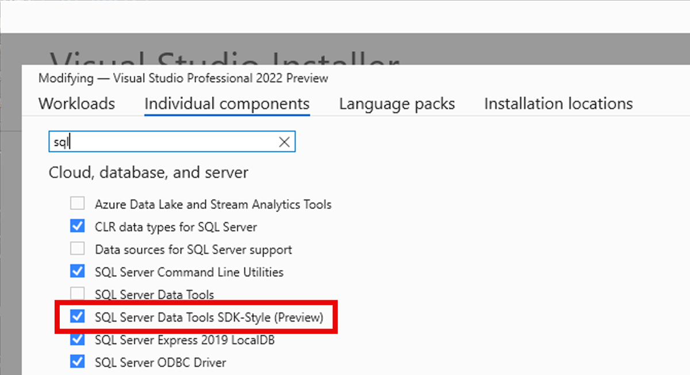

A atualização no Visual Studio 17.14 apresenta novos modelos de itens e referências de banco de dados .dacpac para SQL Server Data Tools no estilo SDK (preview). Os projetos SQL SSDT no estilo SDK são baseados no Microsoft.Build.Sql SDK, que oferece suporte multiplataforma e recursos aprimorados de CI/CD para projetos do SQL Server Data Tools (SSDT).

Com arquivos de projeto menos detalhados e referências de banco de dados a pacotes NuGet, as equipes podem colaborar com mais eficiência em grandes bancos de dados dentro de um único projeto ou compilar vários conjuntos de objetos de diversos projetos. As implantações de banco de dados de um projeto Microsoft.Build.Sql podem ser automatizadas em ambientes Windows e Linux usando a ferramenta Microsoft.SqlPackage dotnet para publicar o artefato de compilação (.dacpac) do projeto SQL. Saiba mais sobre [projetos SQL no estilo SDK e DevOps para SQL](https://aka.ms/sqlprojects).

Na versão 17.14, as [referências de banco de dados](https://learn.microsoft.com/sql/tools/sql-database-projects/concepts/database-references?pivots=sq1-visual-studio-sdk) foram expandidas para dar suporte a referências de artefato de projeto e .dacpac. O suporte a referências de banco de dados como referências de pacotes estará disponível em uma versão futura. Uma atualização recente do [gerador de arquivos de solução slngen](https://github.com/microsoft/slngen) também adicionou suporte a projetos Microsoft.Build.Sql, permitindo o gerenciamento de grandes soluções de forma programática.

Para usar projetos SQL no estilo SDK em sua solução, certifique-se de instalar o componente de visualização mais recente do SSDT no instalador do Visual Studio.

