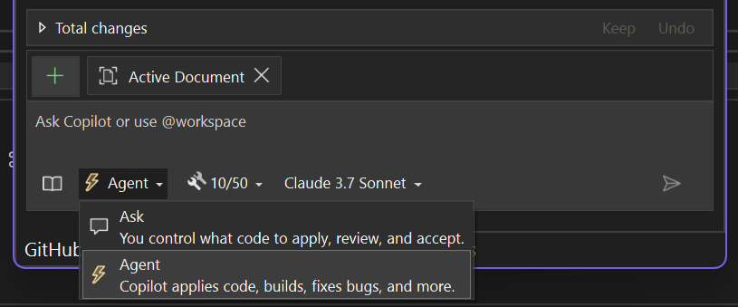

Благодаря ему вы откроете для себя новый способ разработки с помощью GitHub Copilot — он может выполнять не только единичные задания, но и целые процедуры от начала до конца.

Чтобы начать работу, откройте чат Copilot Chat, нажмите кнопку **Запрос** и переключитесь в режим **Агент**.

### От идеи к коду

Режим агента понимает, чего вы хотите добиться, разрабатывает план, извлекает нужный контекст и делает то, что вам нужно. Он может устранять ошибки, изменять файлы и формировать для вас решение — пока вы не достигнете поставленной цели, и для этого достаточно сделать всего один запрос.

Интеграция с MCP также позволяет в режиме агента извлекать из подключенных систем, таких как GitHub, конвейеры CI или панели мониторинга, расширенный контекст для выполнения еще более интеллектуальных действий.

Опробуйте эту функцию и узнайте, какие улучшения она несет!

### Хотите попробовать?
Активируйте GitHub Copilot Free и получите доступ к этой ИИ-функции, а также другие возомжности.
Никаких пробных периодов. Не нужна кредитная карта. Только ваша учетная запись на GitHub. [Скачать Copilot Free](https://github.com/settings/copilot).
