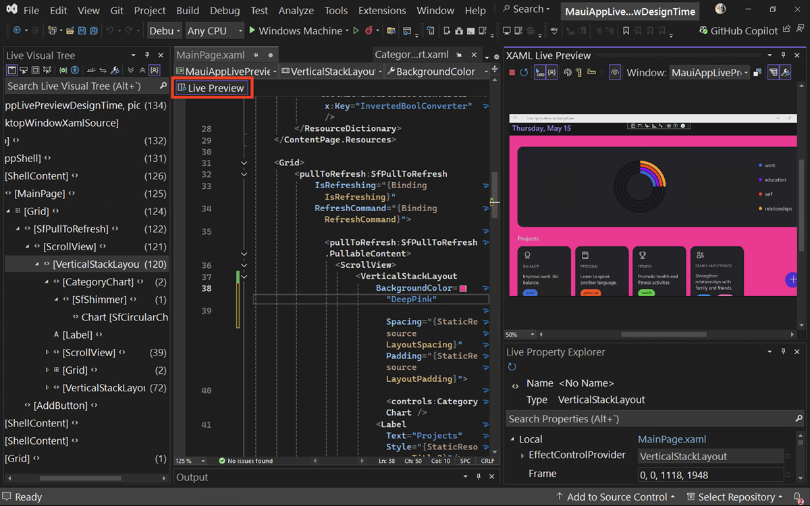

Теперь во время разработки доступна функция динамического просмотра, которая позволяет вам видеть изменения в пользовательском интерфейсе вашего приложения в режиме реального времени. Таким же образом можно использовать горячую перезагрузку и прочие инструменты из пользовательского интерфейса, обеспечивая бесперебойность рабочего процесса.

Эти инструменты можно даже использовать с отключенным отладчиком, благодаря чему вы можете без прерываний экспериментировать и улучшать свои проекты.

Чтобы во время разработки получить доступ к функции динамического просмотра из любого файла XAML, нажмите новый индикатор **Динамический просмотр**:

Эти улучшения помогут вам быстрее и увереннее предоставлять клиентам качественные приложения — как новые приложения .NET MAUI, так и улучшенные существующие приложения WPF.
