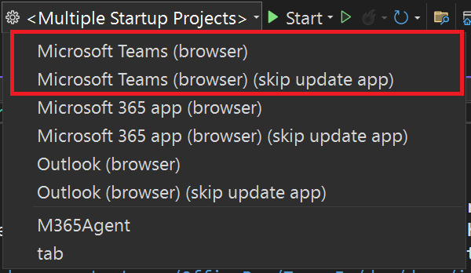

Мы рады сообщить, что мы переименовали продукт Teams Toolkit в Microsoft 365 Agent Toolkit. Мы сделали это, чтобы подчеркнуть более широкое поле нашей деятельности и наше стремление расширить список поддерживаемых платформ и типов проектов в экосистеме Microsoft 365.

В процессе совершенствования нашего продукта мы все больше отходим от идеи поддерживать разработку исключительно в Teams — теперь мы хотим предоставить разработчикам возможность создавать агенты Microsoft 365 Copilot и другие приложения на платформе Microsoft 365. В число этих платформ входят Microsoft 365 Copilot, Microsoft Teams, семейство продуктов Office, а также Outlook. Благодаря этому мы сможем повысить качество обслуживания пользователей, предоставив им доступ к разнообразным инструментам, шаблонам и ресурсам, позволяющим разрабатывать самые разные решения Microsoft 365.

Новое название этого набора инструментов, Microsoft 365 Agent Toolkit, в большей степени отражает разнообразие функций и возможностей, которые предлагает наш продукт. Мы считаем, что благодаря этому пользователям будет проще оценить весь спектр возможностей разработки, которые доступны в среде Microsoft 365.

Спасибо вам за то, что вы помогаете нам совершенствовать наши продукты и услуги, чтобы удовлетворять новые потребности нашего сообщества разработчиков.

### Создание декларативных агентов 

Мы рады сообщить, что в этот выпуск добавлены шаблоны проектов для создания декларативных агентов для Microsoft 365 Copilot.

Декларативный агент можно создать с действием или без. Вы можете настроить новые API или использовать существующие, чтобы выполнять задачи или извлекать данные.

Пользуйтесь Microsoft 365 Agents Toolkit для отладки и предварительного просмотра декларативных агентов в Microsoft Copilot.

### Включение отладки в фоновом режиме одним щелчком
В предыдущих версиях продукта Teams Toolkit, который теперь называется Microsoft 365 Agents Toolkit, перед отладкой любого решения пользователю необходимо было выполнить команду **Подготовка зависимостей приложений Teams**. Она активировала данный набор инструментов, чтобы помочь разработчикам создать ресурсы, необходимые для отладки, например зарегистрировать или обновить приложение Teams.

Чтобы сделать процедуру отладки в Visual Studio более удобной и интуитивно понятной для пользователей, мы исключили этот этап и внедрили технологию отладки одним щелчком. Теперь вам не придется готовиться к отладке — достаточно лишь нажать соответствующую кнопку. Однако если в промежутке времени между двумя событиями отладки вы внесли изменения в манифест приложения и данное приложение необходимо обновить, то вы по-прежнему сможете это сделать.
Мы предлагаем два профиля отладки:

- **Отладка с обновлением приложения**: , если вы внесли изменения в приложение, выберите профиль по умолчанию `[Your Target Launch Platform] (browser)`, чтобы гарантировать применение обновлений.
- **Отладка без обновления приложения**: выберите второй профиль `[Your Target Launch Platform] (browser) (skip update app) `, чтобы пропустить обновление ресурсов приложения для упрощения и ускорения выполнения отладки.

### Выполните обновление до .NET 9

Кроме того, в этом выпуске обновлены все шаблоны проектов, чтобы они поддерживали .NET 9.

**Удачного программирования!**  
*Команда Microsoft 365 Agents Toolkit*
