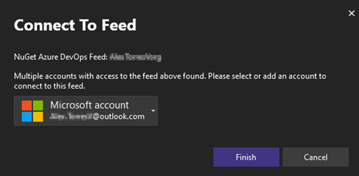

Мы усовершенствовали проверку подлинности с помощью NuGet. Если мы выявим какие-либо возможные проблемы с проверкой подлинности, теперь перед вами отобразится новое диалоговое окно проверки подлинности с контекстом о канале и требованиях соответствующей учетной записи.

В этом обновлении мы усовершенствовали процедуру повторной проверки подлинности, если она многофакторная (MFA), устранили проблемы с последовательными запросами проверки подлинности и в целом оптимизировали управление частными каналами NuGet.
