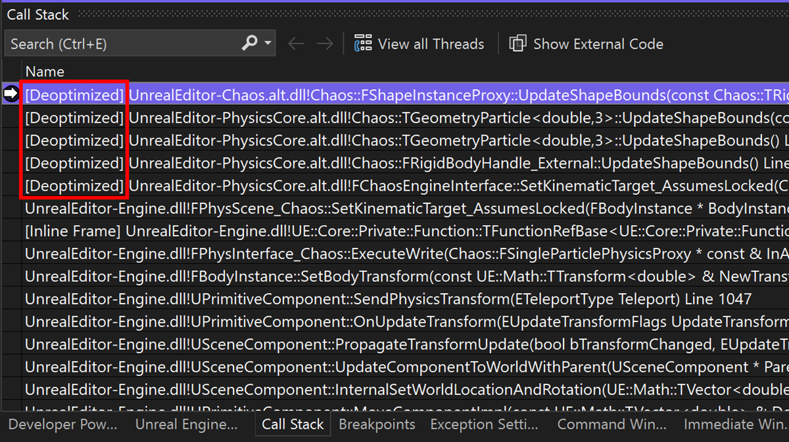

İyileştirilmiş kodda hata ayıklama artık her zamankinden daha kolay. C++ Dinamik Hata Ayıklama'yı etkinleştirerek iyileştirilmiş kodunuzun hatalarını iyileştirilmemiş gibi ayıklayabilirsiniz. Tüm yerel değişkenlerinizi görüntüleyebilir, her yerde adımlayabilir ve iyileştirilmiş ikili dosyalarınızda tam uygunluk kesme noktaları ayarlayabilirsiniz. Daha fazla ayrıntı için lütfen [blog gönderimizi](https://aka.ms/dynamicdebugging) okuyun.

