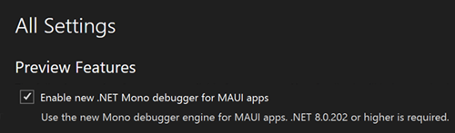

.NET MAUI uygulamaları için yeni Mono hata ayıklayıcısı, Visual Studio hata ayıklayıcısıyla tümleştirilmiş gelişmiş bir hata ayıklama altyapısıdır. Visual Studio'nun geri kalanıyla güvenilirlik, performans ve özellik eşliği konusunda önemli geliştirmeler sunar.

Önemli geliştirmeler arasında *Yalnızca Kodum*, *değişkenler* ve *ifade değerlendirmesi* yer alıyor.

Bu özelliği kullanmak için aşağıdaki Visual Studio Önizleme seçeneğini etkinleştirdiğinizden emin olun: **MAUI uygulamaları için yeni .NET Mono hata ayıklayıcısının etkinleştirilmesi**.

*Şu anda bu özellik yalnızca Android platformu için kullanılabilir. iOS desteği yakında gelecek.*
