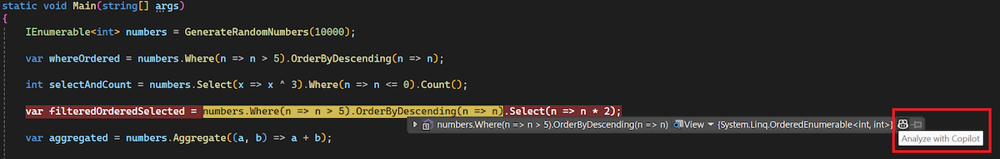

LINQ sorgularının oluşturulması ve sorunlarının giderilmesi, genellikle hassas söz dizimi bilgisi ve çok sayıda yineleme gerektiren sıkıcı ve karmaşık bir süreç olabilir. Visual Studio 2022, bu zorlukları hafifletmek için artık hata ayıklayıcısında linq on-hover DataTip özelliğine sahiptir.

Hata ayıklama sırasında kesme durumundayken çalışma zamanında anlık sorgu değerini değerlendirmek için LINQ sorgunuzun tek tek cümlelerinin veya segmentlerin üzerine gelebilirsiniz.

Ayrıca, üzerine geldiğiniz belirli sorgu yan tümcesinde *Copilot ile analiz et* işlemini gerçekleştirmek için DataTip'in sonundaki GitHub Copilot simgesine tıklayabilirsiniz. Copilot daha sonra cümlenin sözdizimini açıklayacak ve neden belirtilen sonucu aldığınızı açıklayacaktır.

Bu özellik verimliliği önemli ölçüde artırabilir ve hata ayıklama deneyiminizi daha sorunsuz ve kolay hale getirerek LINQ sorgularındaki sorunları daha hızlı belirlemenize ve genel geliştirme iş akışınızı kolaylaştırmanıza yardımcı olabilir.

### Bunu denemek ister misiniz?
GitHub Copilot Ücretsiz'i etkinleştirin ve bu Yapay Zeka özelliğinin yanı sıra çok daha fazlasının kilidini açın.
Deneme yok. Kredi kartı yok. Yalnızca GitHub hesabınız. [Copilot Ücretsiz'i edinin](https://github.com/settings/copilot).
