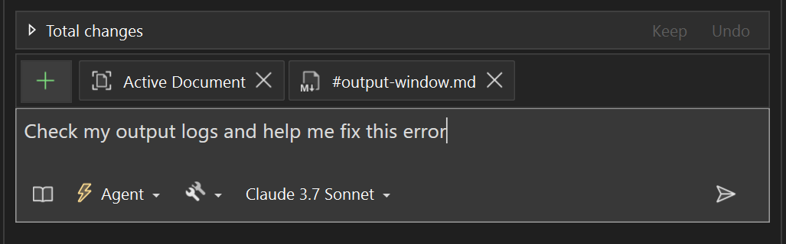

Çıktı Penceresinin derlemeleri izlemek, hata ayıklamak ve kaputun altında neler olup bittiğini anlamak için gerekli olduğunu biliyoruz. Artık Copilot bu bilgileri okuyabilir - böylece soru sorabilir, yardım alabilir ve çıkış günlüklerinize göre harekete geçebilirsiniz.

### Nasıl Kullanılır?
- Doğrudan sohbette başvurmak için `#output` kullanın.
- Bağlam olarak eklemek için sohbet girişindeki ➕ simgesine tıklayın.
- Copilot'a doğrudan sorun: *Çıkış günlüklerimi denetle ve bu hatayı düzeltmeme yardımcı ol.*
- İsterseniz **Çıkış Penceresi**'ne sağ tıklayıp **Copilot ile açıkla**'yı seçerek anında ekleyebilirsiniz.

Deneyin ve günlüklerinizi okumanın ve bunlara göre hareket etmenin ne kadar kolay olduğunu görün!

### Bunu denemek ister misiniz?
GitHub Copilot Ücretsiz'i etkinleştirin ve bu Yapay Zeka özelliğinin yanı sıra çok daha fazlasının kilidini açın.
Deneme yok. Kredi kartı yok. Yalnızca GitHub hesabınız. [Copilot Ücretsiz'i edinin](https://github.com/settings/copilot).
