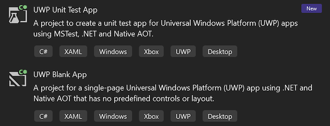

Visual Studio artık .NET 9 ve Native AOT'yi hedefleyen yeni bir UWP MSTest proje şablonu içeriyor. UWP .NET 9 projeleri için gerekli tüm desteği MSTest kütüphanelerine, altyapısına ve Visual Studio test ana bilgisayarına eklemek için MSTest ekibiyle yakın bir şekilde çalıştık. Bu destek, UWP test projelerinin .NET 9'u hedeflemesini ve beklediğiniz gibi UWP bağlamında çalışmaya devam ederken tüm modern .NET SDK ve MSTest araçlarından yararlanmasını sağlar.

NET Native kullanan önceki UWP MSTest proje şablonu hala kullanılabilir olacaktır. Ancak, ileriye dönük olarak .NET 9 ve Native AOT'yi hedefleyen yeni proje şablonlarını kullanmanızı öneririz. Visual Studio 17.13'te olduğu gibi arama sonuçlarında yeni .NET 9 proje şablonlarına öncelik vermek için tüm UWP şablonlarının sıralamasını ayarladık.
