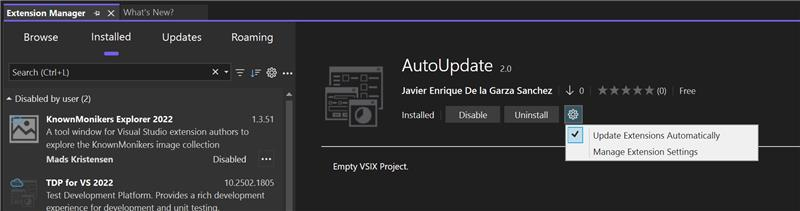

我們很高興在 Visual Studio 中引進了一組強大的新功能，以簡化您的工作流程並改善延伸模組管理體驗。 這些更新可確保您輕鬆保持最新狀態，同時讓您進一步控制套用更新的方式和時機。

### 新功能？

**無縫自動更新**

Visual Studio 現在將會在您開啟應用程式時自動觸發更新，確保您隨時擁有最新的功能和修正，不需手動介入。

**重新啟動已套用更新的金色列**

套用更新時，金色列通知將會出現，提示您重新啟動 Visual Studio，讓變更生效。

**延伸模組頁面中的自動更新設定**

我們已將自動更新設定直接整合到延伸模組頁面中，讓您更容易使用，以便快速存取設定選項。

**依擱置中的變更篩選**

新的**擱置中**類別現在會醒目提示暫止的變更，讓您隨時掌握需要注意的更新和修改。

**自動更新設定**

除了延伸模組頁面，自動更新設定現在位於 **[工具] > [選項] > [環境] > [延伸模組]** 下，讓設定管理體驗更直覺化。

**簡易設定體驗**

我們已簡化設定 UI，讓您更輕鬆地以較少的點選次數和更清楚的選項來設定自動更新和其他的相關喜好設定。

**已排除的延伸模組清單**

Visual Studio 現在具有已排除的延伸模組清單，會自動填入，可協助您管理不應自動更新的延伸模組。 這對於您偏好手動控制版本更新的任務關鍵性延伸模組特別有用。

這些增強功能的設計可以改善可用性、減少更新摩擦，並讓您更充分掌控您的開發環境，同時確保您受益於最新的改進。
