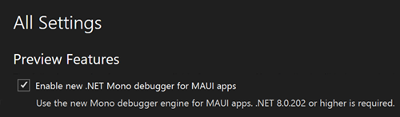

適用於 .NET MAUI 應用程式的新 Mono 偵錯工具是一個進階偵錯引擎，其已整合至 Visual Studio 的偵錯工具中。 它在可靠性、效能以及與 Visual Studio 其餘部分對等的功能方面提供了顯著的改善。

值得注意的增強包括「*僅我的程式碼*」、*變數*和*運算式評估*。

若要使用此功能，確定您已啟用下列 Visual Studio 預覽選項：**為 MAUI 應用程式啟用新的 .NET Mono 偵錯工具**。

*目前，此功能僅適用於 Android 平台。iOS 支援即將推出。*
