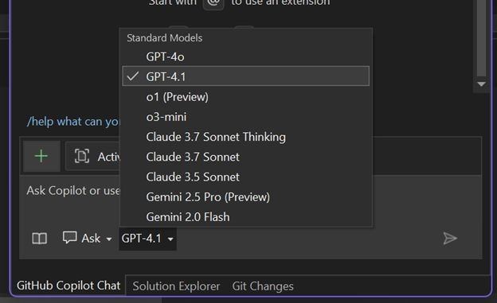

更強大的功能、更快速的效能與更靈活的操作——全都在您的 IDE 中！

### 🚨 Gemini 2.5 Pro 現已在 Visual Studio 中推出

Gemini 2.5 Pro 被廣泛認為是表現最佳的模型之一，現在已獲得 Visual Studio 的支援。 它與 GPT-4.1、GPT-4o、Claude Sonnet 3.7、Claude Sonnet 3.5 和 o3 mini 相結合，為您的 IDE 帶來真正多功能的多模型 AI 體驗。

### 🚨 GPT-4.1 現已成為預設模型

GPT-4.1 現已成為 Visual Studio 中的預設模型，提供更快速、更靈敏且顯著更順暢的整體使用體驗。

---

您現在可以根據手頭的任務、程式碼和工作流程，選擇最適合的模型。 快試試看，並告訴我們您的想法吧！

### 想要試用嗎？
啟用 GitHub Copilot 免費版，即可解鎖此 AI 功能以及更多功能。
 無試用期限。 無需信用卡。 只需擁有 GitHub 帳戶即可。 [取得 Copilot 免費版](https://github.com/settings/copilot)。
