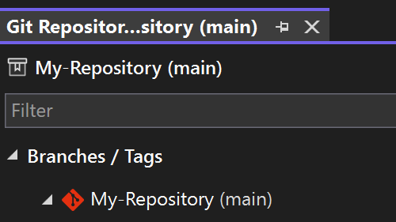

[Git 存放庫視窗](vscmd://Team.Git.GoToGitSynchronization) {KeyboardShortcut:Team.Git.GoToGitSynchronization} 做為分支作業的專用環境，它可能是您日常進行開發的核心。 如果您發現經常需要在每個 Visual Studio 工作階段中重新開啟它，此更新的目的正是用來節省您的時間和精力。

我們已將新的設定新增至 [Git > 設定](vscmd://Team.Git.Settings)，在重新啟動 Visual Studio 時自動還原 Git 存放庫視窗。 此外，此視窗也將包含在您已儲存的視窗配置中，以強化您的自訂選項。

此功能預設為關閉，讓不需要用到它的人員順暢執行工作。 但是如果您喜歡這樣的便利性，這個設定非常好用。

