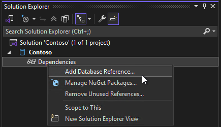
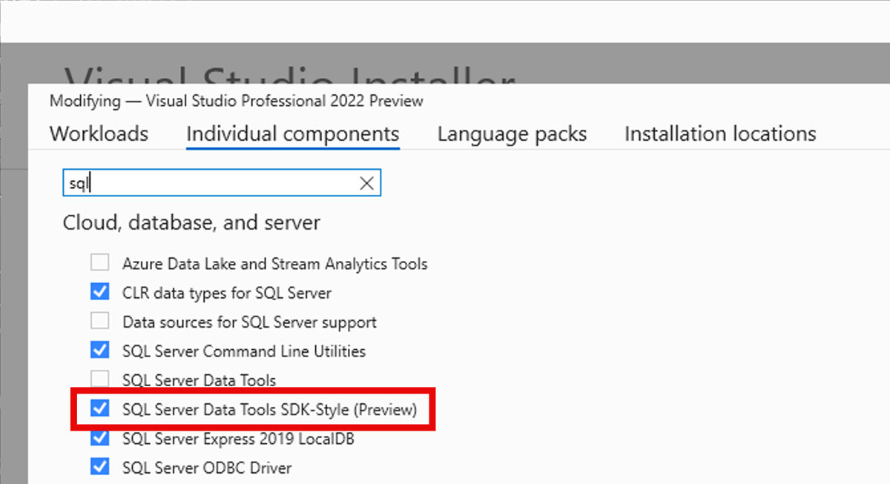

Visual Studio 17.14 中的更新引進了 SDK 樣式 SQL Server Data Tools 的新項目範本和 .dacpac 資料庫參考 (預覽版)。 SDK 樣式 SSDT SQL 專案是以 Microsoft.Build.Sql SDK 為基礎，可提供跨平台的支援，並改善 SQL Server Data Tools (SSDT) 專案的 CI/CD 功能。

透過詳細度較低的專案檔案和 NuGet 套件的資料庫參照，團隊可以更有效率地協作單一專案的大型資料庫，或編譯數個專案的多個物件集。 可以使用 Microsoft.SqlPackage dotnet 工具從 SQL 專案發佈建置成品 (.dacpac)，在 Windows 和 Linux 環境中自動執行來自 Microsoft.Build.Sql 專案的資料庫部署。 深入瞭解 [SDK 樣式 SQL 專案和適用於 SQL 的 DevOps](https://aka.ms/sqlprojects)。

在 17.14 中，[資料庫參考](https://learn.microsoft.com/sql/tools/sql-database-projects/concepts/database-references?pivots=sq1-visual-studio-sdk)已經擴充，以支援專案和 .dacpac 成品參考。 未來版本將支援以套件參考的方式做為資料庫參考。 最新推出的 [slngen 解決方案檔案產生器](https://github.com/microsoft/slngen)更新內容也新增了對於 Microsoft.Build.Sql 專案的支援，能夠以程式設計的方式管理大型解決方案。

若要在解決方案中使用 SDK 樣式的 SQL 專案，請確保在 Visual Studio 安裝程式中安裝最新的 SSDT 預覽元件。

